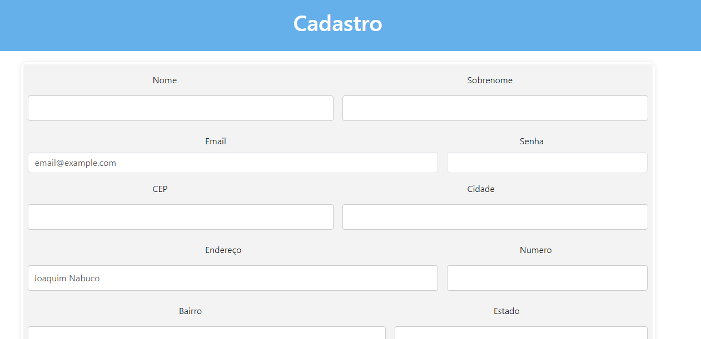

# Formulário de cadastro com consulta de CEP e preenchimento automático

### Descrição:

O Formulário de Cadastro consiste em uma série de campos de preenchimento necessários para a utilização de uma plataforma posterior em outros sites.

### Funcionalidades:

'Consulta de CEP': o site, através das funções aplicadas no JavaScript, realiza uma busca de endereço com o número do CEP inserido pelo usuário.
  
- `Limpar campos preenchidos`: utiliza a Arrow Function e o método test que executa uma busca por uma correspondência entre uma expressão regular e uma string para limpar os campos preenchidos incorretamente, com número inválido de caracteres ou com caracteres que não são números.

- `Preenche campos do formulário`: preenche o os campos restantes de rua, bairro, cidade e estado conforme o cep indicado pelo usuário. Para realizar esse preenchimento, foi utilizado as informações e o código de referência para buscar as informações dentro dos Correios. 

- `Tela adaptável`: a tela se adapta a diversos dispositivos conforme o site do bootstrap.
  
- `CEP encontrado`: ao informar um CEP válido, o site consultará os dados de que correspondem ao CEP dentro da ViaCep e preencherá os campos restantes.

- `CEP não encontrado`: ao informar um CEP não existente, o site informará que o CEP não foi encontrado.

- `CEP inválido`: ao inserir um número ou caractere inválido, o site retornará uma mensagem de CEP inválido.

### Pesquisa:

Em sala de aula, uma pesquisa fora realizada para identificação de requisitos necessários para incrementar nosso cadastro de endereço.

Os sites consultados foram os seguintes:

Após a identificação dos requisitos NOME COMPLETO,  CONFIRMAR SENHA e CONFIRMAR EMAIL, seguimos para a implementação dessas áreas em nosso formulário.

### ✒️Autores 

Larissa Manrique
[Acesse o GitHub](https://github.com/larissassk)  
Ana Paula  
[Acesse o GitHub](https://github.com/anapaulacd)  
Vitória Gabrieli  
[Acesse o GitHub](https://github.com/vickieww)  
Orientador Leonardo Rocha  
[Acesse o GitHub](https://github.com/LeonardoRochaMarista)

